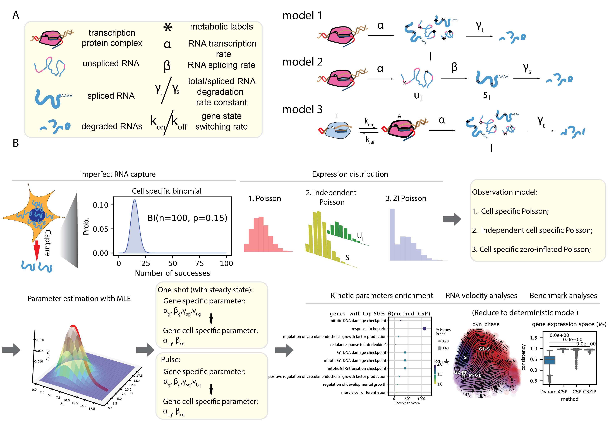

# Storm: Incorporating transient stochastic dynamics to infer the RNA velocity with metabolic labeling information

Storm is a parametric inference framework for labeled kinetics data and one-shot data based on the chemical master equation. Three different stochastic models are solved analytically: a model considering only transcription and degradation, a model considering gene expression switching, transcription and degradation, and a model considering transcription, splicing and degradation. For the kinetics data, we inferred gene-specific parameters without relying on the steady-state assumption, and for the one-shot data, the steady-state assumption was re-invoked. Furthermore, Storm relaxes the constant parameter assumption over genes/cells to obtain gene-cell-specific transcription/splicing rates and gene-specific degradation rates, thus revealing time-dependent and cell-state specific transcriptional regulations.

#  Highlights of Storm
- Storm does not require steady-state assumptions on the kinetics experiments.
- Storm's stochastic model-based approach is more consistent with real biological process than the previous deterministic ODE model.
- Quantitative results show that the RNA velocity inferred by Storm outperforms previous methods in terms of both consistency and correctness.

# Installation
Storm focuses on parametric inference and calculation of RNA velocity of metabolic labeling scRNA-seq data, and its data preprocessing and visualization still relies on the [Dyanmo](https://dynamo-release.readthedocs.io/en/latest/index.html) package.
- 
